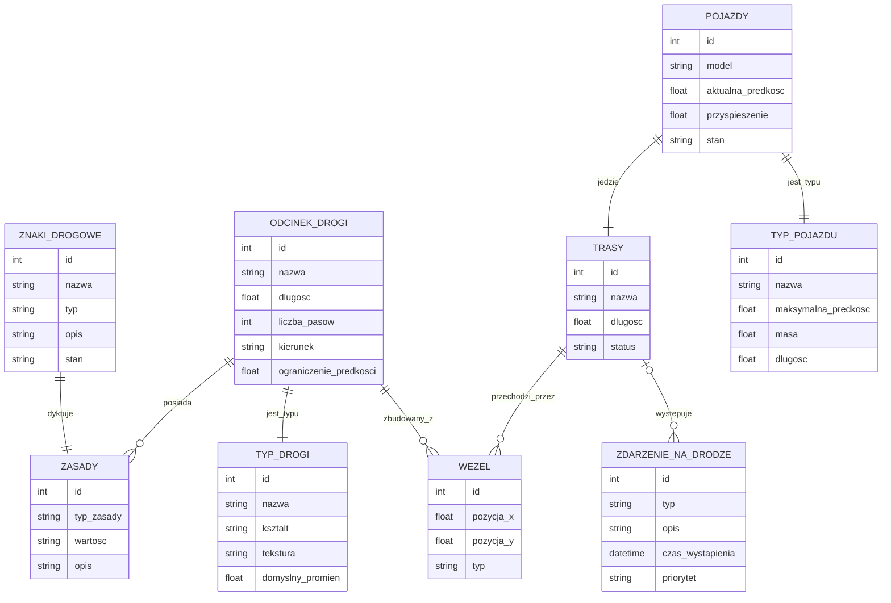

# Model domeny
## Encje
- **Węzły (do tworzenia ścieżek)** - punkty kontrolne wykorzystywane do tworzenia oraz łączenia odcinków dróg i tras przejazdu.
- **Odcinek drogi** - fragment drogi pomiędzy węzłami, posiadający określone parametry i zasady ruchu.
- **Typ Drogi** - definicja rodzaju drogi określająca jej kształt oraz właściwości wizualne i funkcjonalne.
- **Trasy** - wyznaczone ścieżki przejazdu pojazdów składające się z połączonych węzłów i odcinków dróg.
- **Pojazdy** - obiekty uczestniczące w symulacji ruchu, poruszające się po wyznaczonych trasach.
- **Typ pojazdu** - definicja parametrów i właściwości danego rodzaju pojazdu, np. prędkości czy masy.
- **Znaki drogowe i sygnalizacja świtlna** - elementy infrastruktury drogowej sterujące ruchem pojazdów i pieszych.
- **Reguły/Zasady ruchu** - zestaw zasad obowiązujących na danym odcinku drogi lub wynikających ze znaków drogowych.
- **Zdarzenia na drodze** - sytuacje występujące podczas symulacji, np. kolizje, korki lub zatrzymania ruchu.

## Relacje
* **Odcinek drogi 🡢 Węzeł** (1:N) *Odcinek drogi* jest zbudowany z *węzłów* 
* **Odcinek drogi 🡢 Zasady** (1:N) *Odcinek drogi* posiada *zasady*
* **Odcinek drogi 🡢 Typ Drogi** (1:1) *Odcinek drogi* jest *typu*
* **Znaki drogowe 🡢 Zasady** (1:1) *Znak* dyktuje *zasady*
* **Trasy 🡢 Węzły** (1:N) *Trasa* przechodzi przez *Węzły*
* **Pojazdy 🡢 Trasy** (1:1) *Pojazd* jedzie *trasą*
* **Pojazdy 🡢 Typ pojazdu** (1:1) *Pojazd* jest *typu*
* **Trasy 🡢 Zdarzenie na drodze** (0..1:N) Na *trasie* występuje wiele *zdarzeń na drodze*
## Uwagi

