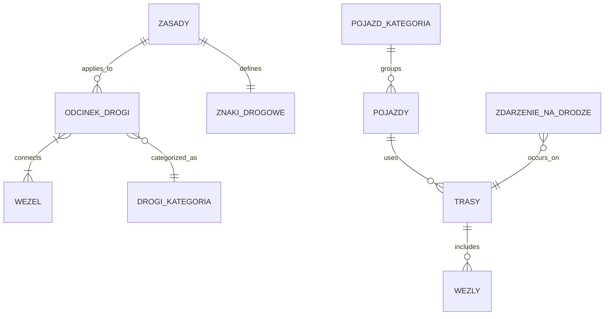

# Model domeny
## Encje
- Węzły (do tworzenia ścieżek)
- Odcinek drogi
- Drogi (kategoria)
- Trasy
- Pojazdy
- Pojazd (kategoria)
- Znaki drogowe i sygnalizacja świtlna
- Reguły/Zasady ruchu
- Zdarzenia na drodze

## Relacje
* **Odcinek drogi >-< Węzeł**
* **Zasady >- Odcinek drogi**
* **Zasady -- Znaki drogowe**
* **Odcinek drogi -< Drogi (kategoria)**
* **Trasy -< Węzły**
* **Pojazdy -< Trasy**
* **Pojazd (kategoria) -- Pojazdy**
* **Zdarzenie na drodze >- Trasy**
## Uwagi

