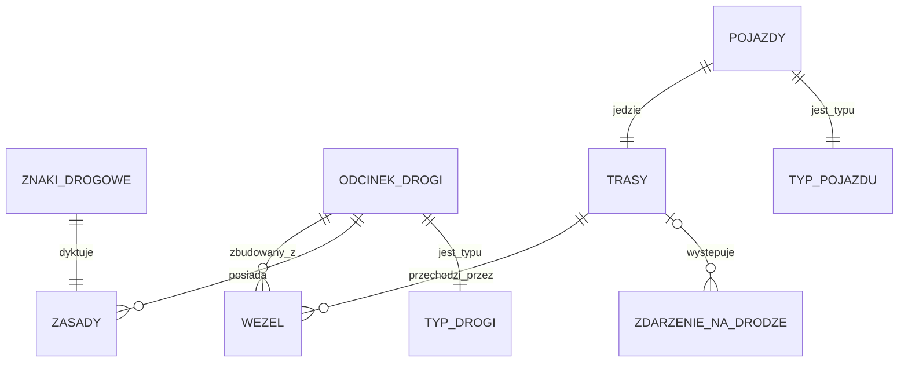

# Model domeny
## Encje
- Węzły (do tworzenia ścieżek)
- Odcinek drogi
- Typ Drogi
- Trasy
- Pojazdy
- Typ pojazdu
- Znaki drogowe i sygnalizacja świtlna
- Reguły/Zasady ruchu
- Zdarzenia na drodze

## Relacje
* **Odcinek drogi 🡢 Węzeł** (1:N) *Odcinek drogi* jest zbudowany z *węzłów* 
* **Odcinek drogi 🡢 Zasady** (1:N) *Odcinek drogi* posiada *zasady*
* **Odcinek drogi 🡢 Typ Drogi** (1:1) *Odcinek drogi* jest *typu*
* **Znaki drogowe 🡢 Zasady** (1:1) *Znak* dyktuje *zasady*
* **Trasy 🡢 Węzły** (1:N) *Trasa* przechodzi przez *Węzły*
* **Pojazdy 🡢 Trasy** (1:1) *Pojazd* jedzie *trasą*
* **Pojazdy 🡢 Typ pojazdu** (1:1) *Pojazd* jest *typu*
* **Trasy 🡢 Zdarzenie na drodze** (0..1:N) Na *trasie* występuje wiele *zdarzeń na drodze*
## Uwagi

