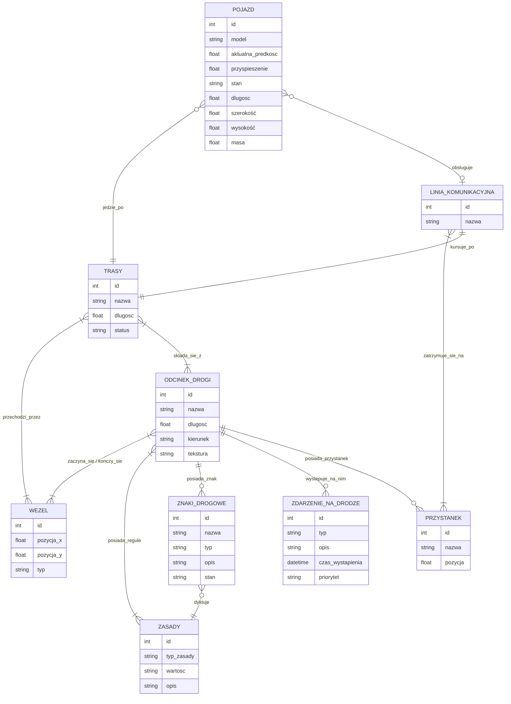

# Model domeny
## Encje
- **Węzły (do tworzenia ścieżek)** - punkty kontrolne wykorzystywane do tworzenia oraz łączenia odcinków dróg i tras przejazdu.
- **Odcinek drogi** - fragment drogi pomiędzy węzłami, posiadający określone parametry i zasady ruchu.
- **Trasy** - wyznaczone ścieżki przejazdu pojazdów składające się z połączonych węzłów i odcinków dróg.
- **Pojazdy** - obiekty uczestniczące w symulacji ruchu, poruszające się po wyznaczonych trasach.
- **Znaki drogowe i sygnalizacja świtlna** - elementy infrastruktury drogowej sterujące ruchem pojazdów i pieszych.
- **Reguły/Zasady ruchu** - zestaw zasad obowiązujących na danym odcinku drogi lub wynikających ze znaków drogowych.
- **Zdarzenia na drodze** - sytuacje występujące podczas symulacji, np. kolizje, korki lub zatrzymania ruchu.
- **Linia komunikacyjna** - usystematyzowany ciąg przystanków połączonych wyznaczoną trasą, regularnie obsługiwany przez przypisane do niego pojazdy (np. autobusy, tramwaje).
- **Przystanek** - wyznaczone fizycznie miejsce na odcinku drogi, w którym pojazdy autobusy lub tramwaje zatrzymują się.

## Relacje
* **Odcinek drogi 🡢 Węzeł** (M:N) *Odcinek drogi* jest zbudowany z *węzłów* 
* **Odcinek drogi 🡢 Zasady** (M:N) *Odcinek drogi* posiada *zasady*
* **Odcinek drogi 🡢 Znaki drogowe** (1:N) *Odcinek drogi* posiada wiele *znaków*
* **Odcinek drogi 🡢 Zdarzenie na drodze** (1:N) Na *odcinku drogi* może wystąpić wiele *zdarzeń*
* **Odcinek drogi 🡢 Przystanek** (1:N) Na jednym *odcinku drogi* może znajdować się wiele *przystanków*
* **Znaki drogowe 🡢 Zasady** (N:1) *Znak* dyktuje *zasady*
* **Trasy 🡢 Węzły** (M:N) *Trasa* przechodzi przez *Węzły*
* **Pojazdy 🡢 Trasy** (N:1) *Pojazdy* jadą *trasą*
* **Linia komunikacyjna 🡢 Przystanek** (M:N) *Linia komunikacyjna* obsługuje wiele *przystanków*
* **Linia komunikacyjna 🡢 Trasy** (1:1) *Linia komunikacyjna*  kursuje po dokładnie jednej wyznaczonej *trasie* przejazdu
* **Pojazdy 🡢 Linia komunikacyjna** (N:1) Wiele *pojazdów* może obsługiwać jedną *linię*
## Diagram

