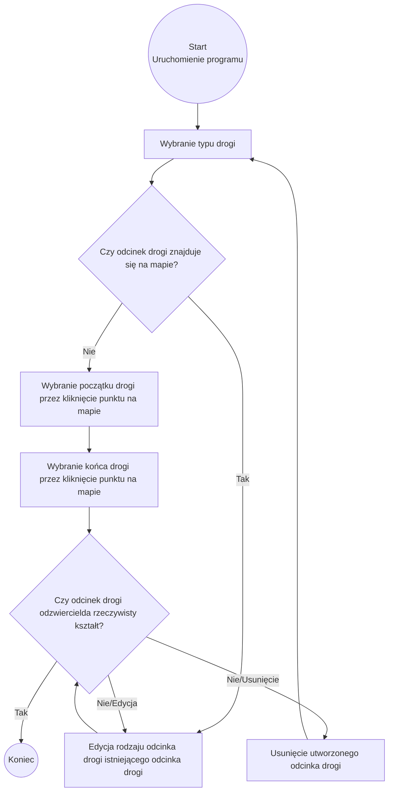

Uworzenie odcinka drogi
połącząnego z istniejeącą drogą lub nie
problem wielu pasów 

flowchart TD
    A[User visits website] --> B{Is user logged in?}

    B -- No --> C[Show login/signup page]
    C --> D[User enters credentials]
    D --> E{Valid credentials?}

    E -- No --> F[Show error message]
    F --> C

    E -- Yes --> G[Redirect to dashboard]

    B -- Yes --> G

    G --> H[User browses content]
    H --> I{User performs action?}

    I -- View item --> J[Display item details]
    I -- Logout --> K[Log out user]

    J --> H
    K --> A
