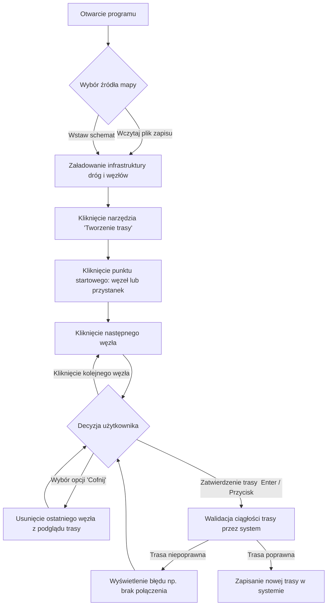

```mermaid
flowchart TD
    A[Otwarcie programu] --> B{Wybór źródła mapy}
    
    B -- Wczytaj plik zapisu --> C[Załadowanie infrastruktury dróg i węzłów]
    B -- Wstaw schemat --> C
    
    C --> D[Kliknięcie narzędzia 'Tworzenie trasy']
    D --> E[Kliknięcie punktu startowego: węzeł lub przystanek]
    
    E --> F[Kliknięcie następnego węzła]
    
    F --> G{Decyzja użytkownika}
    
    G -- Kliknięcie kolejnego węzła --> F
    
    G -- Wybór opcji 'Cofnij' --> H[Usunięcie ostatniego węzła z podglądu trasy]
    H --> G
    
    G -- Zatwierdzenie trasy  Enter / Przycisk --> I[Walidacja ciągłości trasy przez system]
    
    I -- Trasa niepoprawna --> J[Wyświetlenie błędu np. brak połączenia]
    J --> G
    
    I -- Trasa poprawna --> K[Zapisanie nowej trasy w systemie]
```
