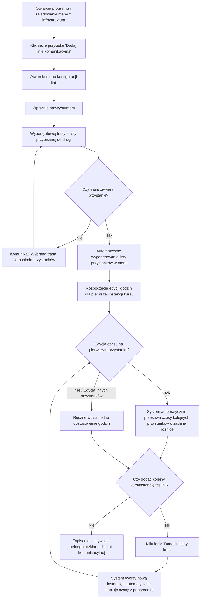

```mermaid
flowchart TD
    A[Otwarcie programu i załadowanie mapy z infrastrukturą] --> B[Kliknięcie przycisku 'Dodaj linię komunikacyjną']
    
    B --> C[Otwarcie menu konfiguracji linii]
    C --> D[Wpisanie nazwy/numeru]
    D --> E[Wybór gotowej trasy z listy przypisanej do drogi]
    
    E --> F{Czy trasa zawiera przystanki?}
    F -- Nie --> G[Komunikat: Wybrana trasa nie posiada przystanków]
    G --> E
    
    F -- Tak --> H[Automatyczne wygenerowanie listy przystanków w menu]
    H --> I[Rozpoczęcie edycji godzin dla pierwszej instancji kursu]
    
    I --> J{Edycja czasu na pierwszym przystanku?}
    
    J -- Tak --> K[System automatycznie przesuwa czasy kolejnych przystanków o zadaną różnicę]
    J -- Nie / Edycja innych przystanków --> L[Ręczne wpisanie lub dostosowanie godzin]
    
    K --> M{Czy dodać kolejny kurs/instancję tej linii?}
    L --> M
    
    M -- Tak --> N[Kliknięcie 'Dodaj kolejny kurs']
    N --> O[System tworzy nową instancję i automatycznie kopiuje czasy z poprzedniej]
    O --> J
    
    M -- Nie --> P[Zapisanie i aktywacja pełnego rozkładu dla linii komunikacyjnej]
```
