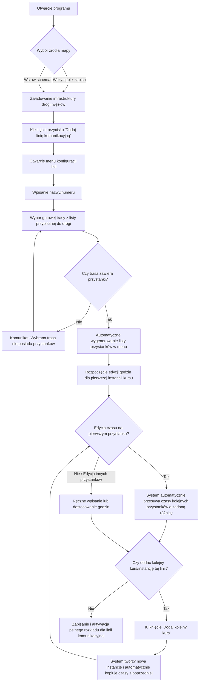

```mermaid
flowchart TD
    A[Otwarcie programu] --> B{Wybór źródła mapy}
    
    B -- Wczytaj plik zapisu --> C[Załadowanie infrastruktury dróg i węzłów]
    B -- Wstaw schemat --> C
    
    C --> D[Kliknięcie przycisku 'Dodaj linię komunikacyjną']
    
    D --> E[Otwarcie menu konfiguracji linii]
    E --> F[Wpisanie nazwy/numeru]
    F --> G[Wybór gotowej trasy z listy przypisanej do drogi]
    
    G --> H{Czy trasa zawiera przystanki?}
    H -- Nie --> I[Komunikat: Wybrana trasa nie posiada przystanków]
    I --> G
    
    H -- Tak --> J[Automatyczne wygenerowanie listy przystanków w menu]
    J --> K[Rozpoczęcie edycji godzin dla pierwszej instancji kursu]
    
    K --> L{Edycja czasu na pierwszym przystanku?}
    
    L -- Tak --> M[System automatycznie przesuwa czasy kolejnych przystanków o zadaną różnicę]
    L -- Nie / Edycja innych przystanków --> N[Ręczne wpisanie lub dostosowanie godzin]
    
    M --> O{Czy dodać kolejny kurs/instancję tej linii?}
    N --> O
    
    O -- Tak --> P[Kliknięcie 'Dodaj kolejny kurs']
    P --> Q[System tworzy nową instancję i automatycznie kopiuje czasy z poprzedniej]
    Q --> L
    
    O -- Nie --> R[Zapisanie i aktywacja pełnego rozkładu dla linii komunikacyjnej]
```
