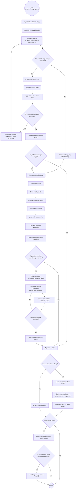

```mermaid
flowchart TD
    A((Start<br>Uruchomienie programu)) --> B[Wybór lub utworzenie mapy]

    %% US13
    B --> C[Otwarcie menu typów dróg]
    C --> D[Wybór typu drogi<br>np. prosta, zakręt, rondo, skrzyżowanie]

    D --> E{Czy odcinek drogi istnieje na mapie?}

    E -- Nie --> F[Wybranie początku drogi]
    F --> G[Wybranie końca drogi]
    G --> H[Wygenerowanie odcinka drogi]

    E -- Tak --> I[Wybranie istniejącego odcinka drogi]

    %% Walidacja połączeń
    H --> J{Czy połączenie drogi jest poprawne?}
    J -- Nie --> K[Wyświetlenie błędu niekompatybilnych połączeń]
    K --> D

    J -- Tak --> L[Wyświetlenie wizualizacji drogi]

    %% Edycja parametrów
    I --> M[Edycja parametrów drogi]
    L --> N{Czy odcinek wymaga edycji?}

    N -- Tak --> M
    N -- Nie --> O[Zapisanie odcinka]

    M --> M1[Zmiana typu drogi]
    M1 --> M2[Zmiana liczby pasów]
    M2 --> M3[Zmiana promienia zakrętu]
    M3 --> M4[Zmiana tekstury drogi]
    M4 --> M5[Ustawienie zasad ruchu]
    M5 --> M6[Dodanie znaków i sygnalizacji]
    M6 --> M7[Ustawienie ograniczenia prędkości]

    %% US14
    M7 --> P{Czy użytkownik chce ustawić natężenie ruchu?}

    P -- Tak --> Q[Otwarcie panelu konfiguracji natężenia ruchu]
    Q --> R[Dodanie przedziału czasowego<br>Od HH:MM do HH:MM]
    R --> S[Ustawienie wartości natężenia ruchu]

    S --> T{Czy dodać kolejny przedział?}
    T -- Tak --> R
    T -- Nie --> U[Zapisanie harmonogramu ruchu]

    P -- Nie --> O
    U --> O

    %% Symulacja
    O --> V{Czy uruchomić symulację?}

    V -- Tak --> W[Uruchomienie symulacji ruchu]
    W --> X[Generowanie pojazdów zgodnie z harmonogramem]
    X --> Y[Analiza ruchu i możliwych kolizji]

    V -- Nie --> Z[Powrót do edycji mapy]

    %% Zapis i udostępnianie
    Y --> AA{Czy zapisać mapę?}
    Z --> AA

    AA -- Tak --> AB[Zapis mapy lokalnie lub w bazie danych]
    AA -- Nie --> AE((Koniec))

    AB --> AC{Czy udostępnić mapę innym użytkownikom?}

    AC -- Tak --> AD[Publikacja mapy w bazie danych]
    AC -- Nie --> AE

    AD --> AE((Koniec)) 
```

    J --> H
    K --> A
