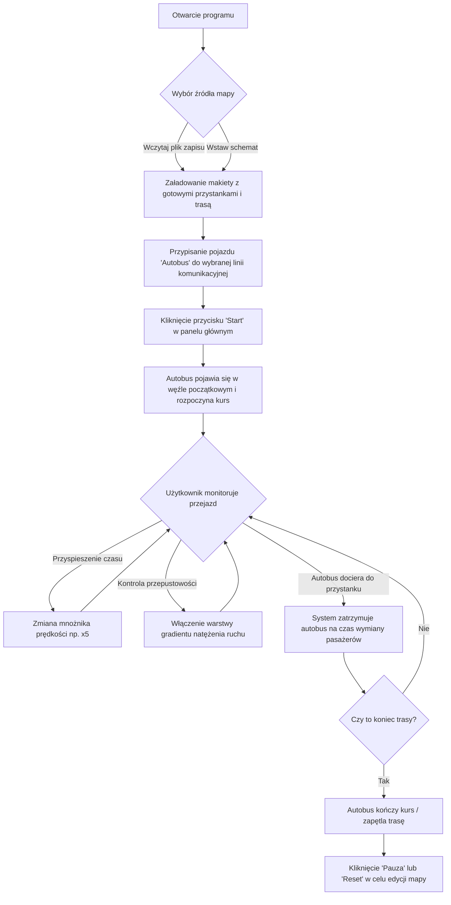

```mermaid
flowchart TD
    A[Otwarcie programu] --> B{Wybór źródła mapy}
    
    B -- Wczytaj plik zapisu --> C[Załadowanie makiety z gotowymi przystankami i trasą]
    B -- Wstaw schemat --> C
    
    C --> D[Przypisanie pojazdu 'Autobus' do wybranej linii komunikacyjnej]
    
    D --> E[Kliknięcie przycisku 'Start' w panelu głównym]
    E --> F[Autobus pojawia się w węźle początkowym i rozpoczyna kurs]
    
    F --> G{Użytkownik monitoruje przejazd}
    
    G -- Przyspieszenie czasu --> H[Zmiana mnożnika prędkości np. x5]
    H --> G
    
    G -- Kontrola przepustowości --> I[Włączenie warstwy gradientu natężenia ruchu]
    I --> G
    
    G -- Autobus dociera do przystanku --> J[System zatrzymuje autobus na czas wymiany pasażerów]
    
    J --> K{Czy to koniec trasy?}
    
    K -- Nie --> G
    K -- Tak --> L[Autobus kończy kurs / zapętla trasę]
    
    L --> M[Kliknięcie 'Pauza' lub 'Reset' w celu edycji mapy]
```
